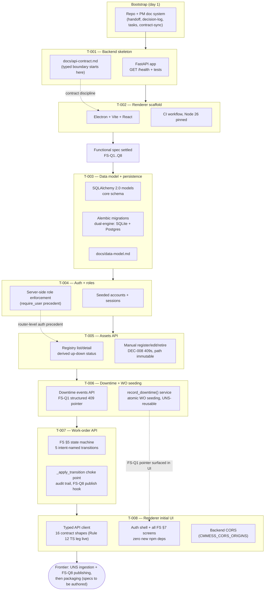

# Development History — CMMess (temp doc)

> **Temporary doc.** Rendered snapshot of the commit history as of 2026-07-22 (`57cbc02`).
> Regenerate or delete once stale; the git log is the authority.

## Commit graph

```mermaid
gitGraph
  commit id: "00cbd61 initial commit" tag: "day 1"
  commit id: "e55eab0 project structure"
  commit id: "1b20473 doc refs: api-contract, contract-sync"
  commit id: "f06d32a remove deprecated setup docs"
  commit id: "482baab refocus repo as CMMS"
  commit id: "0a3e2a2 T-001 backend skeleton" tag: "T-001"
  commit id: "5e8f57f T-001 health check + tests"
  commit id: "8abd7b8 health check hardening"
  commit id: "2f0b28e asset authority / WO origin docs" tag: "DEC-008"
  branch T-002-renderer-scaffold-ci
  commit id: "b45fcd0 T-002 renderer scaffold + CI" tag: "T-002"
  commit id: "dc1f60c pin CI Node 26, regen lockfile"
  checkout main
  merge T-002-renderer-scaffold-ci id: "84761ff PR #1 merged"
  commit id: "507543d PM: TRAP-001 refinement"
  commit id: "6f75765 PM: T-002 closed, frontier set"
  commit id: "c6ef379 PM: functional spec settled" tag: "FS-Q1..Q8"
  commit id: "4a5a651 T-003 data model + persistence" tag: "T-003"
  commit id: "288781a PM: T-003 close-out"
  commit id: "04941a4 T-004 auth + roles" tag: "T-004"
  commit id: "bdc7b36 PM: T-004 close-out"
  commit id: "06bfaa3 PM: T-004 close-out (final)"
  commit id: "1e972cb PM: session wrap, backend-first ordering"
  commit id: "22f7608 T-005 assets API" tag: "T-005"
  commit id: "69a891c PM: T-005 close-out, T-005/6/7 specs"
  commit id: "25fa63a T-006 downtime events + WO seeding" tag: "T-006"
  commit id: "de42295 PM: T-006 close-out, T-008 spec"
  commit id: "93dfaa1 T-007 work-order API" tag: "T-007"
  commit id: "23708c5 PM: T-007 close-out, backend surface complete"
  commit id: "a30e497 T-008 renderer initial UI" tag: "T-008"
  commit id: "2d14be3 PM: T-008 close-out, sprint complete"
  commit id: "1366f21 PM: handoff, sprint fully CI-clean"
  commit id: "57cbc02 dev-history snapshot refresh" type: HIGHLIGHT
```

> Note: from T-004 onward, work lands directly on `main` — branch→PR consciously suspended for this session (Architect's call, workflow §8 skip); CI runs post-hoc on each push.

## Phases in order

```mermaid
timeline
  title CMMess development phases
  section 2026-07-21 — Bootstrap
    Repo genesis : Initial commit (35 files) : Project structure & instructions
    Doc cleanup : Fix api-contract / contract-sync refs : Remove INSTANTIATE, SETUP, templates (−1,617 lines)
    Refocus : README + docs realigned as a CMMS
  section 2026-07-22 — T-001 Backend skeleton
    FastAPI base : GET /health, tests, tooling, API contract
    Hardening : Complete skeleton : Enhanced health-check tests
    Governance : Asset authority + work-order origin docs (DEC-008)
  section 2026-07-22 — T-002 Renderer scaffold
    Branch work : Electron + Vite + React scaffold : CI workflow (PR #1)
    CI fix : Pin Node 26, regenerate lockfile (npm-major skew)
    Merge + PM : PR #1 merged : TRAP-001 refined : T-002 closed
  section 2026-07-22 — Spec & T-003 Persistence
    Functional spec : FS-Q1..Q8 ruled, defaults baked in
    Data model : SQLAlchemy 2.0 : Alembic dual-engine (SQLite + Postgres) : Core schema : docs/data-model.md
    Close-out : Index, completed-dev, handoff updated
  section 2026-07-22 — T-004 Auth + roles
    Auth : Seeded accounts : Sessions : Server-side role enforcement
    Session wrap : CI green : Backend-first ordering decided : T-005/6/7 sliced
  section 2026-07-22 — T-005 Assets API
    Registry : List/detail with derived status : Manual register/edit/retire (DEC-008 409s)
    Close-out : T-005/6/7 specs committed : api-contract § Assets
  section 2026-07-22 — T-006 Downtime + WO seeding
    Event→WO core : Downtime events API : Atomic work-order seeding : FS-Q1 pointer 409 : UNS-reusable record_downtime()
    Close-out : design-guide starter : T-008 spec authored
  section 2026-07-22 — T-007 Work-order API
    State machine : FS §5 five intent-named transitions : Planning : Single-choke-point audit trail (_apply_transition)
    Close-out : Backend domain surface complete
  section 2026-07-22 — T-008 Renderer initial UI
    Product surface : Typed API client (16 contract shapes) : Auth shell : All FS §7 screens live : Backend CORS
    Sprint wrap : v1 reactive loop live : TRAP-002 recorded : Sprint fully CI-clean
```

## What each task delivered

## Quick reference

| Task | Commits | Outcome |
|---|---|---|
| Bootstrap | `00cbd61`…`482baab` | Repo, PM doc system, CMMS refocus |
| T-001 | `0a3e2a2`, `5e8f57f`, `8abd7b8` | FastAPI backend skeleton, `/health`, tests, API contract |
| DEC-008 docs | `2f0b28e` | Asset authority by provenance; typed work-order origin |
| T-002 (PR #1) | `b45fcd0`, `dc1f60c`, merge `84761ff` | Electron+Vite+React renderer, CI on Node 26 |
| Functional spec | `c6ef379` | FS-Q1–Q8 ruled, defaults settled |
| T-003 | `4a5a651` | SQLAlchemy 2.0 + Alembic dual-engine, core schema, `docs/data-model.md` |
| T-004 | `04941a4` | Auth + roles: seeded accounts, sessions, server-side role enforcement |
| T-005 | `22f7608` | Assets API: registry list/detail with derived status, manual register/edit/retire |
| T-006 | `25fa63a` | Downtime events API + atomic WO seeding (FS-Q1 pointer 409, UNS-reusable `record_downtime`) |
| T-007 | `93dfaa1` | Work-order API: FS §5 state machine, planning, single-choke-point audit trail |
| T-008 | `a30e497` | Renderer initial UI: typed API client, auth shell, all FS §7 screens; backend CORS |
| PM close-outs | `507543d`, `6f75765`, `288781a`, `bdc7b36`, `06bfaa3`, `1e972cb`, `69a891c`, `de42295`, `23708c5`, `2d14be3`, `1366f21` | Handoff/index kept current after each task; T-005–T-008 specs + design-guide starter landed; sprint closed CI-clean |
